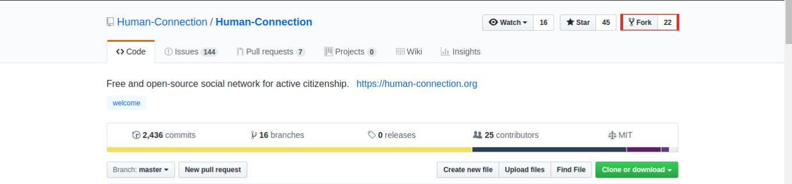

# General Install Instructions

The repository can be found on GitHub. [https://github.com/Human-Connection/Human-Connection](https://github.com/Human-Connection/Human-Connection)


TODO: Create documentation section for How to Start and Beginners.


Here are some general informations about our [GitHub Standard Fork & Pull Request Workflow](https://gist.github.com/Chaser324/ce0505fbed06b947d962).

### Fork the Repository

Click on the fork button.



### Clone your new Repository

Set the current working folder to the path in which the repository should be cloned \(copied\).

```bash
$ cd PATH-FOR-REPO
```

For cloning your new repository to your local machine modify the following command to add your GitHub user name.




```bash
$ git clone https://github.com/YOUR-GITHUB-USERNAME/Human-Connection.git
```





```bash
$ git clone git@github.com:YOUR-GITHUB-USERNAME/Human-Connection.git
```




Change into the new folder.

```bash
$ cd Human-Connection
```

Add the original Human Connection repository as `upstream`. This prepares you to synchronize your local clone with a simple pull command in the future.




```bash
$ git remote add upstream https://github.com/Human-Connection/Human-Connection.git
```





```bash
$ git remote add upstream git@github.com:Human-Connection/Human-Connection.git
```




# Docker Installation

Docker is a software development container tool that combines software and its dependencies into one standardized unit that contains everything needed to run it. This helps us to avoid problems with dependencies and makes installation easier.

## General Installation of Docker

There are [sevaral ways to install Docker CE](https://docs.docker.com/install/) on your computer or server.




Follow these instructions to [install Docker Desktop on macOS](https://docs.docker.com/docker-for-mac/install/).




Follow these instructions to [install Docker Desktop on Windows](https://docs.docker.com/docker-for-windows/install/).




Follow these instructions to [install Docker CE](https://docs.docker.com/install/).

This is a great option for Linux users.




Check the correct Docker installation by checking the version before proceeding. E.g. we have the following versions:

```bash
$ docker --version
Docker version 18.09.2
$ docker-compose --version
docker-compose version 1.23.2
```
## Install Nitro with Docker

Run the following command to install Nitro as a Docker container. This installation includes Neo4j.

The installation takes a bit longer on the first pass or on rebuild ...

```bash
$ docker-compose up

# rebuild the containers for a cleanup
$ docker-compose up --build
```

### Seed Neo4j in Docker

To seed the Neo4j database with default data, that GraphQL requests or playing with our GraphQL Playground returns anything else than an empty response, run the command.

Run the following command to seed the Neo4j database with default data requested by Nitro-Web through GraphQL or when you play with our GraphQL playground.

```bash
# open another terminal

# create indices etc.
$ docker-compose exec neo4j migrate

# seed database
$ docker-compose exec backend yarn run db:seed
```

#### Wipe out Neo4j database in Docker

To wipe out your neo4j database and delete the volumes send command:

```bash
# open another terminal and run
$ docker-compose down -v
```

#### Video Tutorial


TODO: Link to video


### Development with Kubernetes

For further informations see also our [Kubernetes documentation](kubernetes.md).


# Local Installation

### Install the dependencies

```bash
$ yarn
$ cd backend && yarn
$ cd ../
$ cd webapp && yarn
```

### Copy Environment Variables

```bash
$ cd ../
$ cd backend
$ cp .env.template .env
```

Configure the file `.env` according to your needs and your local setup.