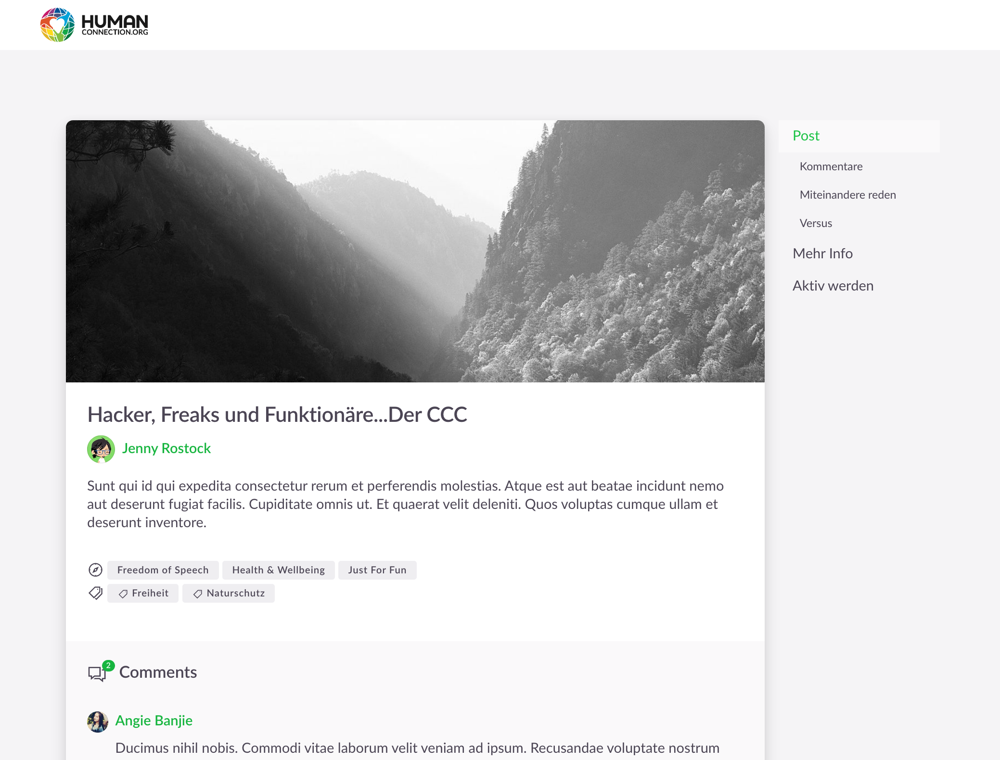

# Human Connection - GraphQL UI Prototype 

> Ui Prototype for HC



## Build Setup

``` bash
# install dependencies
$ yarn install

# serve with hot reload at localhost:3000
$ yarn run dev

# build for production and launch server
$ yarn run build
$ yarn start
```

## Styleguide

All reusable Components (for example avatar) should be done inside the styleguide directory.

### To show the styleguide

``` bash
$ yarn styleguide
```

if you changed design tokens or other styles inside the styleguide, run the refresh command to build the styleguide as a lib

``` bash
$ yarn styleguide:build
```
