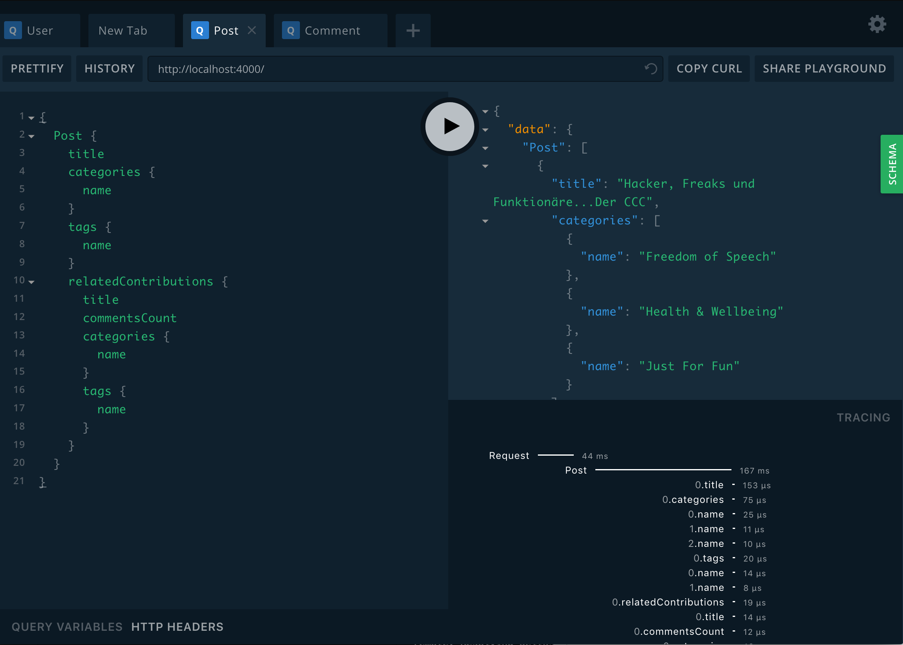

# Human-Connection - NITRO Backend

> This Prototype tries to resolve the biggest hurdle of connecting
> our services together. This is not possible in a sane way using
> our current approach. 
> 
> With this Prototype we can explore using the combination of 
> GraphQL and the Neo4j Graph Database for achieving the connected
> nature of a social graph with better development experience as we
> do not need to connect data by our own any more through weird table
> structures etc.

>  
> #### Advantages:
> - easer data structure
> - better connected data
> - easy to achieve "recommendations" based on actions (relations)
> - more performant and better to understand API
> - better API client that uses caching
>
> We still need to evaluate the drawbacks and estimate the development 
> cost of such an approach

## Quick Start

### Installation with Docker

Run:
```sh
docker-compose up
# if you want seed data
# open another terminal and run
docker-compose exec backend yarn run seedDb
```

App is [running on port 4000](http://localhost:4000/)

To wipe out your neo4j database run:
```sh
docker-compose down -v
```


### Installation without Docker

Install dependencies:

```bash
yarn install
# -or-
npm install
```

Copy:
```
cp .env.template .env
```
Configure the file `.env` according to your needs and your local setup.

Start the GraphQL service:

```bash
yarn start
# -or-
npm start
```

This will start the GraphQL service (by default on localhost:4000)
where you can issue GraphQL requests or access GraphQL Playground in the browser:



## Configure

Set your Neo4j connection string and credentials in `.env`.
For example:

_.env_

```yaml
NEO4J_URI=bolt://localhost:7687
NEO4J_USER=neo4j
NEO4J_PASSWORD=letmein
```

> You need to install APOC as a plugin for the graph you create in the neo4j desktop app!

Note that grand-stack-starter does not currently bundle a distribution
of Neo4j. You can download [Neo4j Desktop](https://neo4j.com/download/)
and run locally for development, spin up a [hosted Neo4j Sandbox instance](https://neo4j.com/download/),
run Neo4j in one of the [many cloud options](https://neo4j.com/developer/guide-cloud-deployment/),
[spin up Neo4j in a Docker container](https://neo4j.com/developer/docker/) or on Debian-based systems install [Neo4j from the Debian Repository](http://debian.neo4j.org/).
Just be sure to update the Neo4j connection string and credentials accordingly in `.env`.

## Mocking API Results

Alternatively you can just mock all responses from the api which let
you build a frontend application without running a neo4j instance.

Just set `MOCK=true` inside `.env` or pass it on application start.

## Seeding and Cleaning The Database

Optionally you can seed the GraphQL service by executing mutations that 
will write sample data to the database:

```bash
yarn db:seed
# -or-
npm run db:seed
```

For a reset you can use the reset script:

```bash
yarn db:reset
# -or-
npm run db:reset
```

## Todo`s

- [x] add jwt authentication
- [ ] get directives working correctly (@toLower, @auth, @role, etc.)
- [ ] check if search is working
- [x] check if sorting is working
- [x] check if pagination is working
- [ ] check if upload is working (using graphql-yoga?)
- [x] evaluate middleware 
- [ ] ignore Posts and Comments by blacklisted Users
