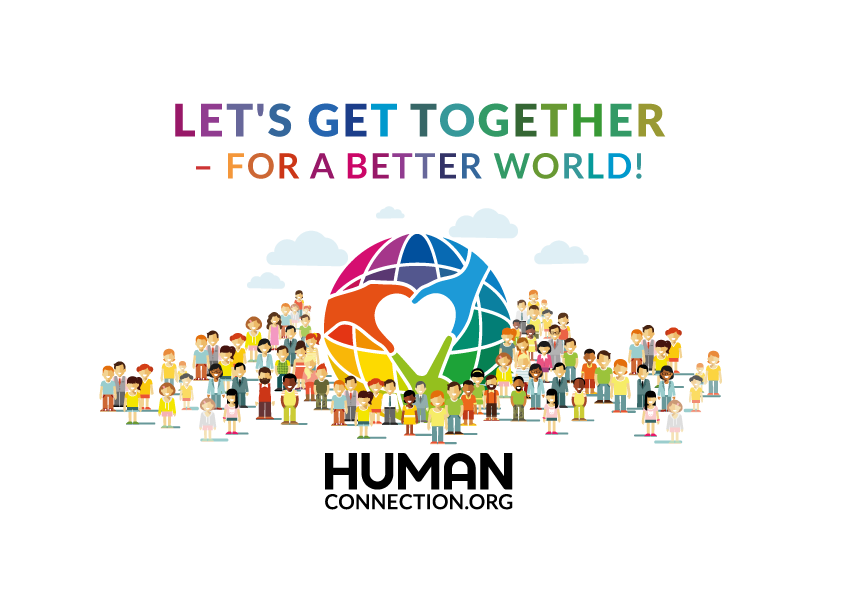

# Human-Connection

 

Human Connection is a nonprofit social, action and knowledge network that connects information to action and promotes positive local and global change in all areas of life.

* **Social**: Interact with other people not just by commenting their posts, but by providing **Pro & Contra** arguments, give a **Versus** or ask them by integrated **Chat** or **Let's Talk**
* **Knowledge**: Read articles about interesting topics and find related posts in the **More Info** tab or by **Filtering** based on **Categories** and **Tagging** or by using the **Fulltext Search**.
* **Action**: Don't just read about how to make the world a better place, but come into **Action** by following provided suggestions on the **Action** tab provided by other people or **Organisations**.

**Technology Stack**

* [VueJS](https://vuejs.org/)
* [NuxtJS](https://nuxtjs.org/)
* [GraphQL](https://graphql.org/)
* [NodeJS](https://nodejs.org/en/)
* [Neo4J](https://neo4j.com/)

## Live demo

Try out our deployed [staging environment](https://nitro-staging.human-connection.org/).

Logins:

| email | password | role |
| :--- | :--- | :--- |
| `user@example.org` | 1234 | user |
| `moderator@example.org` | 1234 | moderator |
| `admin@example.org` | 1234 | admin |

## Documentation

Learn how to set up a local development environment in our [Docs](https://docs.human-connection.org/nitro).

## Translations

Contribute translations on [lokalise.co](https://lokalise.co/public/556252725c18dd752dd546.13222042/).

## Developer Chat

Join the open-source community on [Discord](https://discord.gg/6ub73U3).

