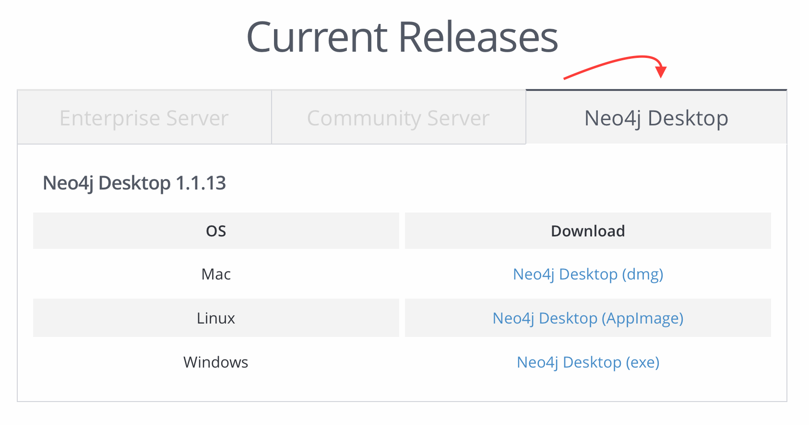

# Neo4j Installation and Configuration


## Configure Enviroment

Set your Neo4j connection string and credentials in `.env`. For example:



```yaml
NEO4J_URI=bolt://localhost:7687
NEO4J_USER=neo4j
NEO4J_PASSWORD=letmein
```




## Neo4j Installation


You **need to install APOC** as a plugin for the graph you create in neo4j!


Note that grand-stack-starter does not currently bundle a distribution of Neo4j.
Now there are a lot alternatives how to install Neo4J.





You can [download Neo4j Desktop](https://neo4j.com/download-center/) run locally for development.
Choose tab **Neo4j Desktop**.



After the download is done install the Neo4j Desktop application and open it.
E.g. we have the following version:

```
Neo4j Desktop 1.1.13
```

Click on the empty project **My Project** to choose it.

Click in the **Add Graph** area and after two buttons appear in it click on **Create a Local Graph**.

Set the name of the new Graph for clarity to **Human Connection DB**, though the name is free.
Set the password to **letmein** which is our default password of our `.env.template`. You can choose another password and later change your connection settings, too. Then click on **Create** and the database will be generated.

After generation of the database was successful, please click in the **Add Plugin** area.
Then click the **Install** button of the **APOC** area.
Now an additional **Install** button appears and you click on it again. If the **APOC-Plugin** is installed by now close the litte **Plugins** window.

In the **Human Connection DB** area is a **Manage** button. By clicking it the area switches into a manage area with a lot of information and setting possibilities.

Start the Graph database by clicking the **Play-Symbol** button and its start up will be proceeded.
In the **Logs** tab you'll find the status of the start up.

If you have a look in the **Details** tab you find the connection info. As you hopefully see the Bolt port is set by default to the number we set already for our [enviroment configuration](#configure-enviroment) above.





You can spin up a [hosted Neo4j Sandbox instance](https://neo4j.com/download-center/), run Neo4j in one of the [many cloud options](https://neo4j.com/developer/guide-cloud-deployment/), [spin up Neo4j in a Docker container](https://neo4j.com/developer/docker/) or on Debian-based systems install [Neo4j from the Debian Repository](http://debian.neo4j.org/). Just be sure to update the Neo4j connection string and credentials accordingly in `.env`.

**Install APOC plugin on Debian-based systems**

When you have install Neo4j from the Debian Repository, then [download the APOC plugin](https://github.com/neo4j-contrib/neo4j-apoc-procedures/releases/download/3.4.0.3/apoc-3.4.0.3-all.jar) to the `/var/lib/neo4j/plugins` directory manually or with:

```text
wget https://github.com/neo4j-contrib/neo4j-apoc-procedures/releases/download/3.4.0.3/apoc-3.4.0.3-all.jar -P /var/lib/neo4j/plugins
```






## Seeding Database with Data

Now we have to seed our database with default data, so that GraphQL requests or playing with our GraphQL Playground returns anything else than an empty response.

To fill the database with some seed data, run the following command in your terminal:
```bash
$ yarn run db:seed
```

To wipe out the database:
```bash
$ yarn run db:reset
```

Now your backend is ready for requests. You can click on the **Open Browser** button in Neo4j Desktop to check if the seeding was successful or open [http://localhost:7474/](http://localhost:7474/) in your browser.

Click the **Data-Symbol** at the left upper corner and then click on the **Node Label** + **User** to see a graph of the user relations, as an example.
