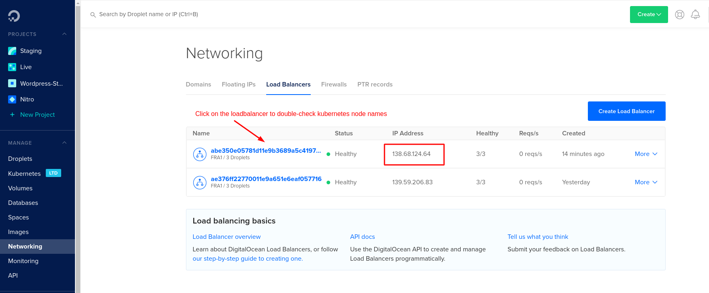

# Setup Ingress and HTTPS

Follow [this quick start guide](https://docs.cert-manager.io/en/latest/tutorials/acme/quick-start/index.html) and install certmanager via helm and tiller:

```text
$ kubectl create serviceaccount tiller --namespace=kube-system
$ kubectl create clusterrolebinding tiller-admin --serviceaccount=kube-system:tiller --clusterrole=cluster-admin
$ helm init --service-account=tiller
$ helm repo update
$ helm install stable/nginx-ingress
$ kubectl apply -f https://raw.githubusercontent.com/jetstack/cert-manager/release-0.6/deploy/manifests/00-crds.yaml
$ helm install --name cert-manager --namespace cert-manager stable/cert-manager
```

## Create Letsencrypt Issuers and Ingress Services

Copy the configuration templates and change the file according to your needs.

```bash
# in folder deployment/digital-ocean/https/
cp templates/issuer.template.yaml ./issuer.yaml
cp templates/ingress.template.yaml ./ingress.yaml
```

At least, **change email addresses** in `issuer.yaml`. For sure you also want
to _change the domain name_ in `ingress.yaml`.

Once you are done, apply the configuration:

```bash
# in folder deployment/digital-ocean/https/
$ kubectl apply -f .
```

By now, your cluster should have a load balancer assigned with an external IP
address. On Digital Ocean, this is how it should look like: 



Check the ingress server is working correctly:

```bash
$ curl -kivL -H 'Host: <DOMAIN_NAME>' 'https://<IP_ADDRESS>'
```

If the response looks good, configure your domain registrar for the new IP address and the domain.

Now let's get a valid HTTPS certificate. According to the tutorial above, check your tls certificate for staging:

```bash
$ kubectl describe --namespace=human-connection certificate tls
$ kubectl describe --namespace=human-connection secret tls
```

If everything looks good, update the issuer of your ingress. Change the annotation `certmanager.k8s.io/issuer` from `letsencrypt-staging` to `letsencrypt-prod` in your ingress configuration in `ingress.yaml`.

```bash
# in folder deployment/digital-ocean/https/
$ kubectl apply -f ingress.yaml
```

Delete the former secret to force a refresh:

```text
$ kubectl  --namespace=human-connection delete secret tls
```

Now, HTTPS should be configured on your domain. Congrats.
