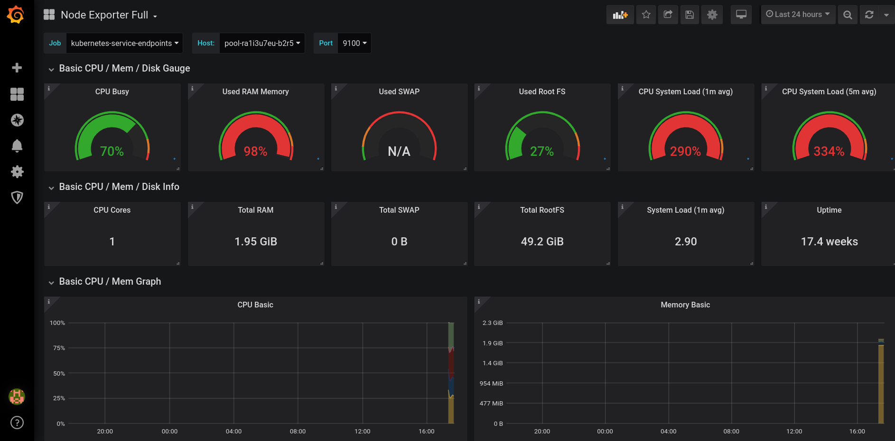

# Metrics

You can optionally setup [prometheus](https://prometheus.io/) and
[grafana](https://grafana.com/) for metrics.

We follow this tutorial [here](https://medium.com/@chris_linguine/how-to-monitor-your-kubernetes-cluster-with-prometheus-and-grafana-2d5704187fc8):

```bash
kubectl proxy # proxy to your kubernetes dashboard

helm repo list
# If using helm v3, the stable repository is not set, so you need to manually add it.
helm repo add stable https://kubernetes-charts.storage.googleapis.com
# Create a monitoring namespace for your cluster
kubectl create namespace monitoring
helm --namespace monitoring install prometheus stable/prometheus
kubectl -n monitoring get pods # look for 'server'
kubectl port-forward -n monitoring <PROMETHEUS_SERVER_ID> 9090
# You can now see your prometheus server on: http://localhost:9090

# Make sure you are in folder `deployment/`
kubectl apply -f monitoring/grafana/config.yml
helm --namespace monitoring install grafana stable/grafana -f monitoring/grafana/values.yml
# Get the admin password for grafana from your kubernetes dashboard.
kubectl --namespace monitoring port-forward <POD_NAME> 3000
# You can now see your grafana dashboard on: http://localhost:3000
# Login with user 'admin' and the password you just looked up.
# In your dashboard import this dashboard:
# https://grafana.com/grafana/dashboards/1860
# Enter ID 180 and choose "Prometheus" as datasource.
# You got metrics!
```

Now you should see something like this:



You can set up a grafana dashboard, by visiting https://grafana.com/dashboards, finding one that is suitable and copying it's id.
You then go to the left hand menu in localhost, choose `Dashboard` > `Manage` > `Import`
Paste in the id, click `Load`, select `Prometheus` for the data source, and click `Import`

When you just installed prometheus and grafana, the data will not be available
immediately, so wait for a couple of minutes and reload.
