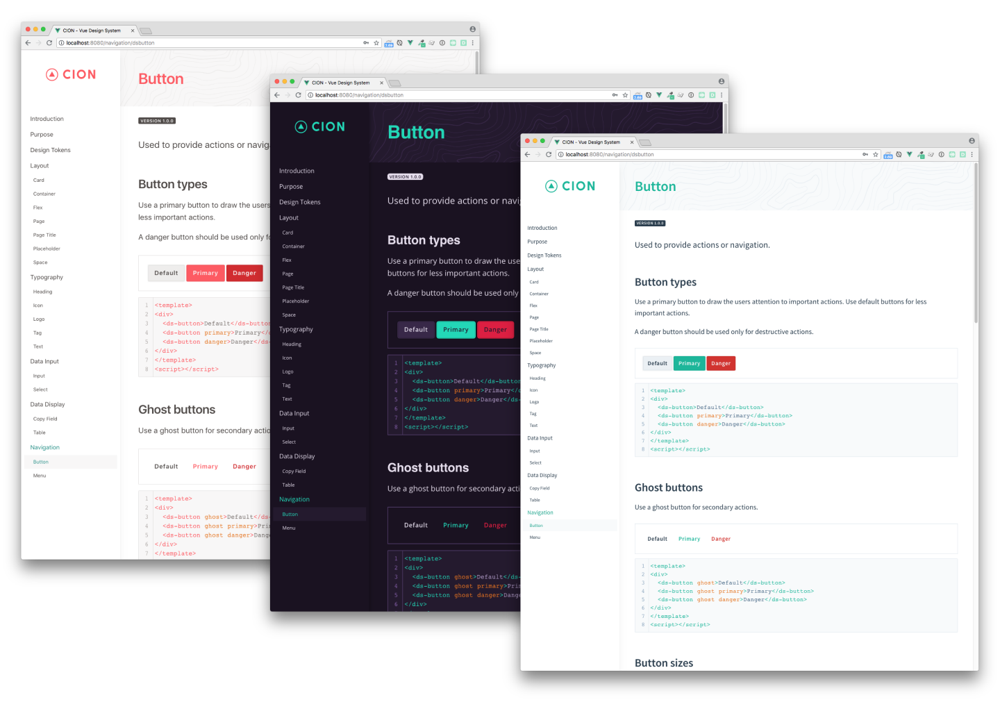

# CION Vue Design System

CION is a Design System build primary for Vue applications. You can use it as a starting point for building your own Design System.

The system utilizes design tokens, a living styleguide with integrated code playgrounds and reusable components for common UI tasks.

Living styleguide demo: https://styleguide.cion.visualjerk.de

Landing page demo: https://cion.visualjerk.de

Integrate it in your application: [Quick Start](https://github.com/visualjerk/vue-cion-design-system/wiki/Quick-Start)

[](https://github.com/visualjerk/vue-cion-design-system/raw/master/preview/customize.png)

## Project setup
```
yarn install
```

## Developing

Compiles and hot-reloads living styleguide

```
yarn dev
```

## Building

### Living styleguide


Compiles living styleguide to `./docs`

```
yarn build
```

### Library

Compiles design system as a library to `./dist`

```
yarn build:lib
```

## Helper

### Serve living styleguide locally
```
yarn serve
```

### Lints and fixes files
```
yarn lint
```
