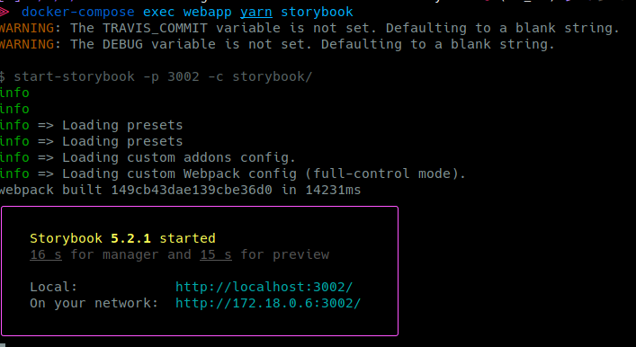

# Webapp


## Installation

```bash
# install all dependencies
$ yarn install
```

Copy:

```text
cp .env.template .env
cp cypress.env.template.json cypress.env.json
```

Configure the files according to your needs and your local setup.

### Build for Development

```bash
# serve with hot reload at localhost:3000
$ yarn dev
```

### Build for Production

```bash
# build for production and launch server
$ yarn build
$ yarn start
```

### Storybook

We encourage contributors to use Storybook to test out new components in an isolated way, and benefit from its many features.
See the docs for live examples and answers to FAQ, among other helpful information. 




After you have started the application following the instructions above, in another terminal run:

```bash
$ docker-compose exec webapp yarn storybook
```
The output should look similar to this:



Click on the link http://localhost:3002/ to open the browser to your interactive storybook.




Run the following command:

```bash
# in webapp/
yarn storybook
```

Open http://localhost:3002/ in your browser





## Styleguide

All reusable Components \(for example avatar\) should be done inside the [Nitro-Styleguide](https://github.com/Human-Connection/Nitro-Styleguide) repository.


More information can be found here: [https://github.com/Human-Connection/Nitro-Styleguide](https://github.com/Human-Connection/Nitro-Styleguide)

If you need to change something in the styleguide and want to see the effects on the frontend immediately, then we have you covered. You need to clone the styleguide to the parent directory `../Nitro-Styleguide` and run `yarn && yarn run dev`. After that you run `yarn run dev:styleguide` instead of `yarn run dev` and you will see your changes reflected inside the frontend!
