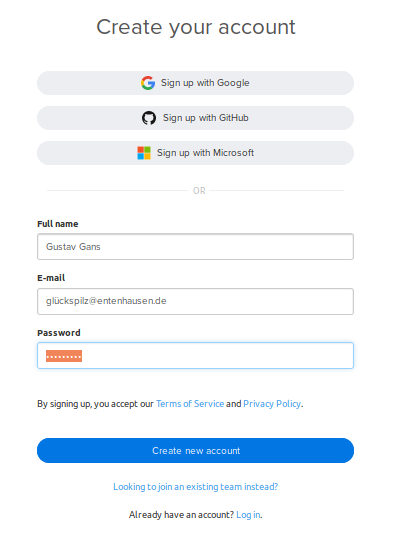
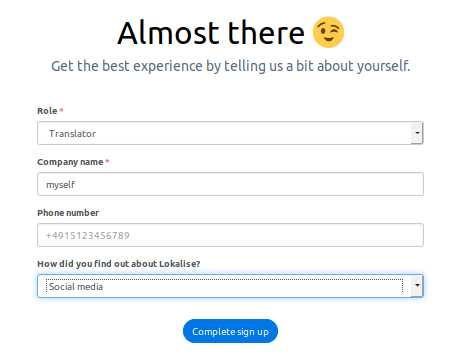
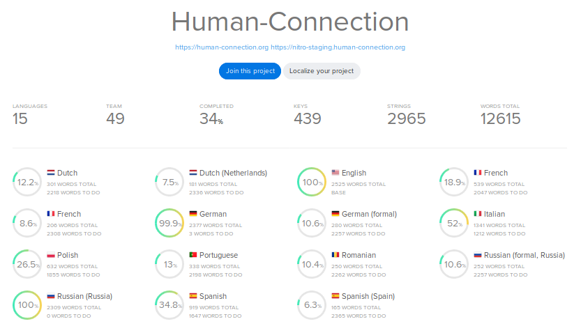
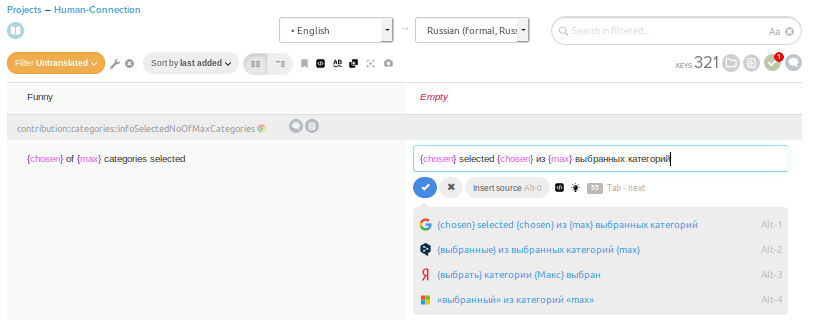
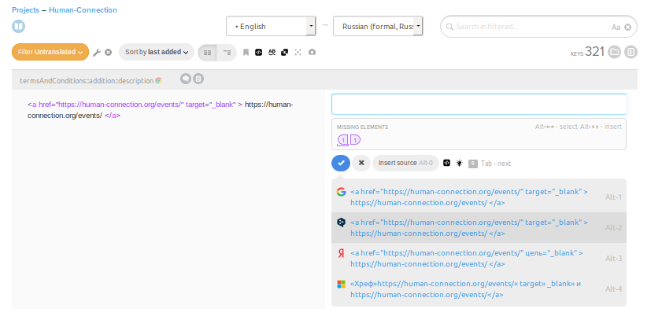
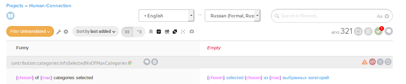

# Translating Human-Connection

## Guideline for volunteers using lokalise

If you don't already have an account, register yourself at
[lokalise.co](https://lokalise.co/signup).

Lokalise is earning money by providing paid services, but to translate for 
Human-Connection the free account is enough. After registration you get 30 days
of trial period for the professional services. After that time you get a notice
that your trial account expired. You can safely ignore this message as the free
account related to Human-Connection still continues.

The next step is fill in some details. Usually you choose *translator* as role.
If you don't represent a company you can enter *myself* or something else you
find applicable.

Once your new account is verified, you can join
[Human-Connection](https://lokalise.co/public/556252725c18dd752dd546.13222042/)

After selecting *Join this project* you choose which language you want to translate to.

If you are familiar with more than one language, you might choose *All*. So you can later
select any language to translate to or use as a reference language to translate from.
If you select only one language, you can at a later point let one of the adminstrators
add another languate to your personal pool.

")

When selecting a reference language you should keep in mind, that English is the projects main
language, to certain degree also German. All translations should mainly use these two as reference.
If you are familiar with anther language that had some time to mature, you could switch to maybe
get a better idea for tricky translations.

If in doubt about the intended maining of an entry you should ask at the 
[developer's chat at Discord](https://discordapp.com/invite/DFSjPaX). Introduce yourself by clicking
*#introduce-yourself* on the left and mention *@@Mentor* to get you onboard.

After that you are ready to translate.

