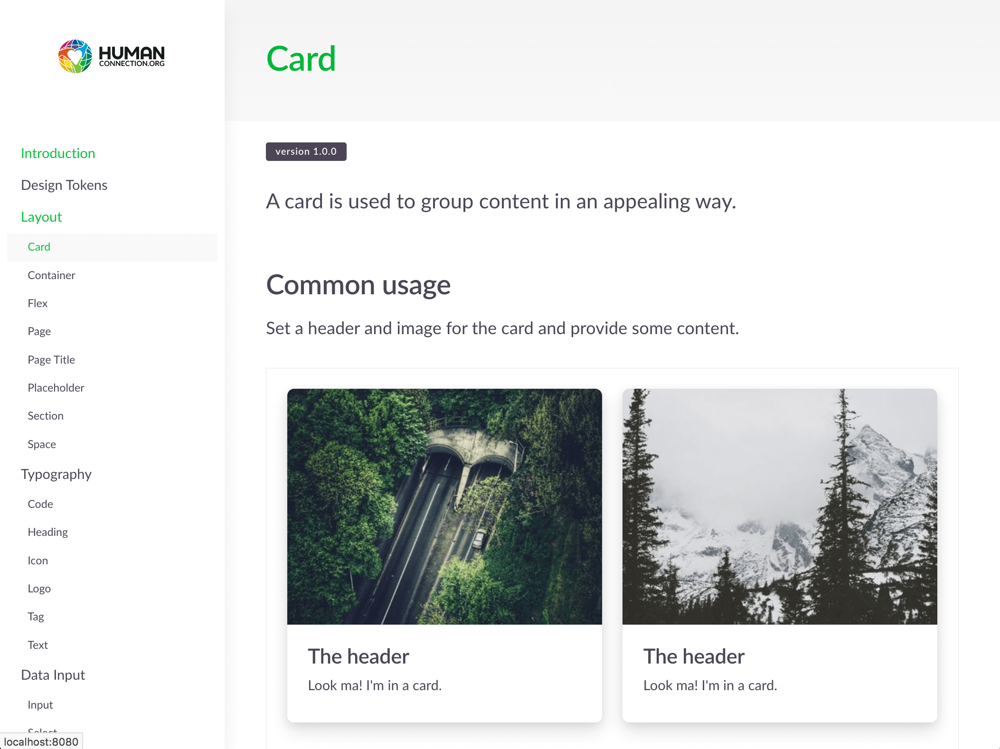

# Styleguide

For this Projoject we decided to use [Jörg Bayreuther's](https://github.com/visualjerk) _\(visualjerk\)_ fantastic Design System called [CION](https://cion.visualjerk.de/). _\(see a_ [_demo_](https://styleguide.cion.visualjerk.de/)_\)_

### Checkout the Styleguide

It's now an npm package. Want to help with it's development or maintenance?

[Head over to the repo](https://github.com/Human-Connection/Nitro-Styleguide)
